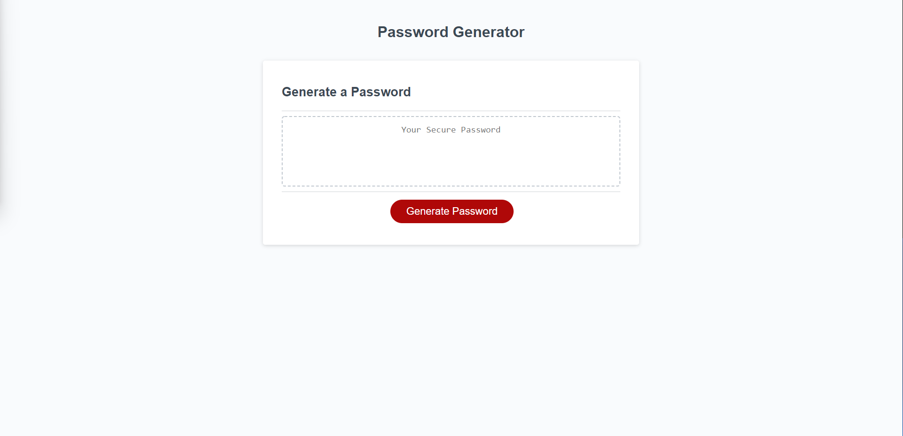

# Module 3 Challenge - Password Generator

## Description

This is the Password Generator web application. These files are for review for the Module 3 Password Generator Challenge.

## Installation

N/A

## Usage

This web app has been created with the following functionality:

To collect user input, including password length and character sets to include, and to generate a random password matching the entered criteria.

## Screenshot/Link

[Password Generator](https://cray412.github.io/Module-3-Challenge-Password-Generator/)

## Credits

N/A

## License

Please refer to the LICENSE in the repo.